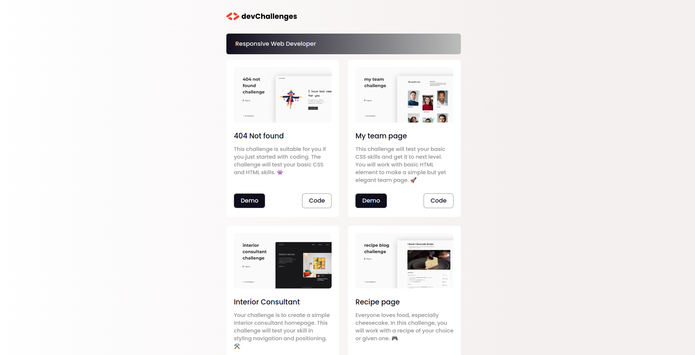

# [devChallengues](https://devchallenges.io/)

> 🦕 You have fun coding!

## 🚀 Project Structure

Inside of your Astro project, you'll see the following folders and files:

```
/
├── public/
│   └── favicon.ico
│   └── logo192.png
│   └── logo512.png
├── src/
│   ├── components/
│   │   └── Card.astro
│   ├── layouts/
│   │   └── Layout.astro
│   └── pages/
│       └── index.astro
└── package.json
```

## 🧞 Commands

All commands are run from the root of the project, from a terminal:

| Command           | Action                                       |
| :---------------- | :------------------------------------------- |
| `npm install`     | Installs dependencies                        |
| `npm run dev`     | Starts local dev server at `localhost:3000`  |
| `npm run build`   | Build your production site to `./dist/`      |
| `npm run preview` | Preview your build locally, before deploying |

## 🎮 Overview

_Screenshot Laptop_



_Screenshot Mobile_


## 😎 Contact

<p><em>Software Developer </p>

[](https://bit.ly/brando-vidal-twitter) [](https://bit.ly/brando-vidal-github)
